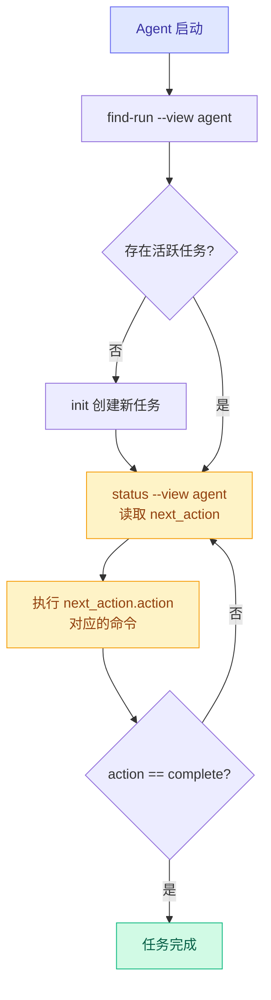
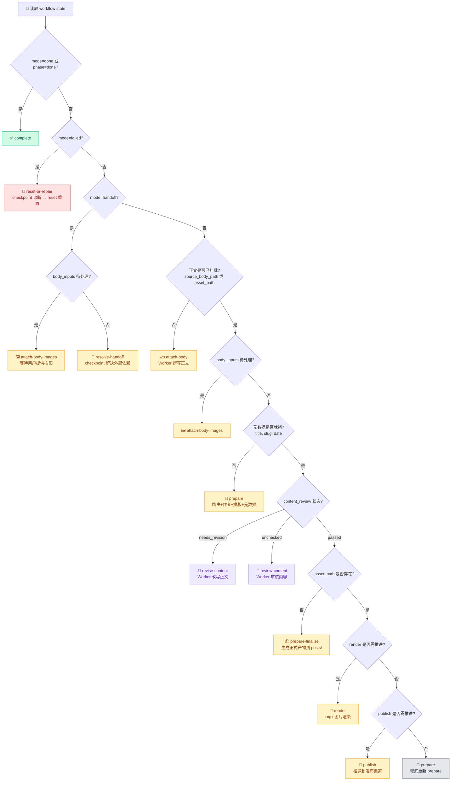
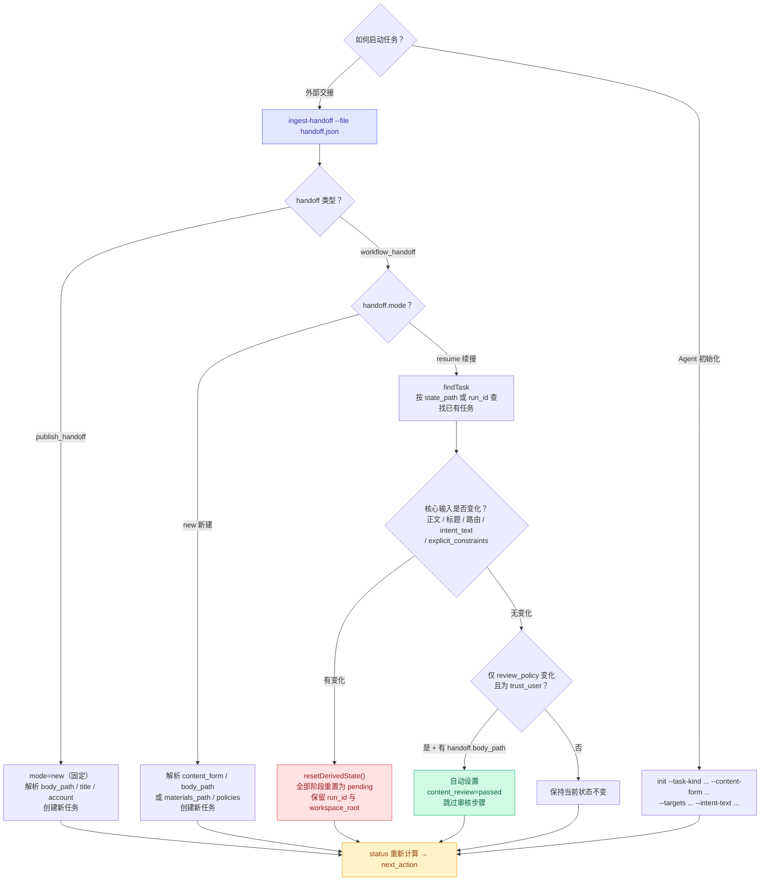

# zzhub-pipeline

面向 Agent 的内容发布状态机，将文案、图片和发布意图收敛为可恢复的工作流，推进到微信公众号文章或图片消息。

## 核心原则

- `state` 是唯一真相源
- Agent 先查任务状态，再决定下一步
- 外部工具先把素材写入 pipeline，再由 pipeline 计算缺口
- 中断后按实际状态恢复，而不是靠会话历史猜测

## 快速开始

前置条件：

- Bun 运行时
- Chrome，用于 `render` 和 `wechat-export`

安装：

```bash
# 从 npm
npm install -g @zzclub/pipeline

# 或从源码
bun install
bun install --global .
```

二进制别名：

- `zzhub-pipeline`
- `zzp`

配置文件位置，macOS 默认是 `~/Library/Application Support/zzhub-pipeline/config.json`。

## 架构概览

这是一个状态机模型，输入是任务意图、正文、图片、路由和发布要求，输出是可恢复的工作流状态、渲染产物和发布结果。

当前只有两条主工作流路由：

- `wechat-article` — 公众号文章草稿（HTML）
- `wechat-newspic` — 公众号图片消息（PNG 卡片/图集）

`blog` 只做事后同步（`sync-blog`），不参与主工作流分支，但同步结果会写回 `workflow-state.json` 的 `publish.results`。

状态文件分两类：

- 运行态，临时文件，`{workspace}/.zzhub-media/runs/{run_id}.json`
- 定稿态，最终文件，`{workspace}/posts/{date-slug}/workflow-state.json`

正文全文不会进入 state，正文内容统一放在 `{workspace}/.zzhub-media/tmp/{run_id}/`。

## 核心流程

### Agent 编排循环

Agent 通过无状态循环驱动流水线，每轮只做一个动作。所有上下文存储在状态文件中，中断后重新执行 `status` 即可精准续接。



### 如何正确调用 Agent Skill

Agent 通过 `.claude/skills/zzhub-publish/SKILL.md` 获取操作指引。任务描述的质量直接决定执行效果。

**反模式（避免）：**

| 不要这样说 | 问题 |
|-----------|------|
| "帮我发一篇文章到公众号" | Agent 不知道主题、没有具体方向。大概率跳过 status 检查或写出空洞内容。 |
| "发一篇关于 AI 的文章" | 主题太泛，agent 会写出套话文章，review 也难以判断好坏。 |
| 不提 handoff 里的已有文件 | Agent 按默认路径重新写稿，浪费已有素材。 |

**模式 A：Agent 从头写稿**

```
调用 zzhub-publish skill，完成以下任务：

文章主题：[具体 topic，一句话说清]
发布目标：大号
要求：
- 每完成一步报告当前状态
- 到 content review 通过后先暂停，等我确认再继续
```

给了具体主题 agent 才有明确的写稿方向，设边界让发布前有人工确认点，每步报告减少盲跳。

**模式 B：从准备好的文件交接**

```
调用 zzhub-publish skill，从我准备好的素材继续：

我已在 /path/to/handoff.json 提供了 handoff 文件，
body 文件也在 handoff 里指定好了（已经是一篇完整文章）。

1. 先读 skill 文件，然后从 ingest-handoff 开始
2. body 已经在 handoff 中指定了路径，不需要重新写稿
3. 按 skill 的 loop 走完后续所有步骤（prepare → review → render → publish）
4. 每一步报告动作和结果
```

明确告知 body 已就绪防止重复劳动，指出入口（ingest-handoff）让 agent 不用猜测，强调"后续所有"让 agent 一口气跑完。

**模式 C：快速出草稿，暂不发布**

```
调用 zzhub-publish skill：

主题：周末咖啡馆随笔，轻松风格，~500字
发布目标：大号
重要：只到 render 完成就停，不要 publish。我要在草稿箱里人工预览后再决定。
```

风格+长度约束写稿质量，负向约束（"不要 publish"）设明确边界。

**核心原则：**

1. **给具体主题** — "咖啡馆里的宇宙学" 远好于 "写一篇文章"。主题越具体产出越可控。
2. **明说上下文差异** — 已有素材或 body 文件一定要说出来，否则 agent 默认走 "init → 写稿"。
3. **在分叉点给提示** — 比如 "review 通过后暂停等我确认"，或 "body 已在 handoff 里准备好了，跳过写稿"。
4. **用负向约束设边界** — "不要 publish"、"到 review 就停" 比正向的 "帮我做 X" 更能防止 agent 跑过头。
5. **先读 skill 再行动** — 指令里加上 "先读 SKILL.md"，尤其是对 sub-agent。不假设 agent 已经知道规则。

### next_action 决策树（优先级 1→12）

`buildTaskStatus()`（`src/task-manager.ts`）按以下优先级依次判断，输出唯一的下一步动作。
每个分支互斥，一旦命中即返回，不会继续判断后续条件。



关键说明：

- C7（content_review）仅在 `asset_path` 尚未存在时触发，`review-content` 和 `prepare-finalize` 都在同一 `!asset_path` 外层分支内
- C9/C10 进入时 `asset_path` 已必然存在（由 `prepare-finalize` 写入），因此直接按 render/publish 阶段状态判断
- `attach-newspic-spec` 不在决策树中 — 它是可选命令，在 render 前由 Agent 自行决定是否附加分页规格
- `reconcile` 不在决策树中 — 它是手动维护命令，用于刷新素材对账，不自动触发

每个 `next_action` 包含：

| 字段 | 说明 |
| --- | --- |
| `action` | 动作标识（如 `attach-body`、`prepare`、`render`） |
| `executor` | 执行者类型：`cli` / `worker` / `await-input` / `repair` / `complete` |
| `command` | 建议的 CLI 命令，含 `--state` 路径 |
| `params` | 执行参数：`state_path`、`source_body_path`、`worker_mode` 等 |
| `on_complete` | 执行后的后续指令（通常是 "re-run status"） |

### 任务入口：init 与 ingest-handoff

任务有两种创建方式：`init`（Agent 直接初始化）和 `ingest-handoff`（外部系统交接 JSON 文件）。



**handoff JSON 格式示例**：

```json
// workflow_handoff — 新建任务
{
  "workflow_handoff": {
    "mode": "new",
    "content_form": "article",
    "body_path": "/abs/path/body.md",
    "target_account": "default",
    "title": "文章标题",
    "user_intent_text": "发公众号文章给大号",
    "review_policy": "required"
  }
}

// workflow_handoff — 续接已有任务
{
  "workflow_handoff": {
    "mode": "resume",
    "state_path": "/abs/path/workflow-state.json",
    "body_path": "/abs/path/revised-body.md",
    "review_policy": "trust_user"
  }
}

// publish_handoff — 简化格式（固定新建）
{
  "publish_handoff": {
    "content_form": "article",
    "body_path": "/abs/path/body.md",
    "target_account": "default",
    "title": "文章标题",
    "user_intent_text": "发公众号"
  }
}
```

`resetDerivedState()` 会重置的内容：

- 全部阶段状态（prepare / render / publish）→ pending
- `asset_path` → 清空，`formatted_body_path` → null
- `metadata`（保留 title）→ 默认值
- `artifacts` / `images` / `publish` / `content_review` → 默认值
- 保留：`run_id`、`workspace_root`、`state_path`、`intent.content_form`

### 三阶段流水线

三个活跃阶段和两个终态：

```
prepare → render → publish → done
                          ↘ failed
```

**prepare 阶段子步骤**（在 `prepare` 命令内部按序执行）：

1. `channel-route` — 解析路由与公众号账号
2. `author-select` — 确定改写权限与风格模式（`rewrite_allowed` / `style_mode`）
3. `format` — 文本排版规则处理
4. `asset-meta` — 提取标题/日期/摘要
5. `body-inputs` — 扫描正文中的插图标记
6. `highlight-words` — 从标题提取封面高亮词（`prepare-finalize` 中完成）
7. `asset-save` — 写入正式文件到 `posts/` 目录（`prepare-finalize` 中完成）

> `style` 润色不在 `prepare` 命令内 —— 它需要 LLM 调用，由外部 Worker 完成后再交回 pipeline。

**render 阶段子步骤**：

1. `image-plan` — 模板选择（wechat-cover-split / poster-3-4 / longform-3-4）
2. `body-inputs` — 收集插图图片（longform 模式下可能暂停等待用户输入）
3. `adapter-render` — 调用图片渲染插件
4. 记录 `render_assets`，递增 `render_version`

**publish 阶段子步骤**：

1. 收集发布路由（primary + extras）
2. 幂等性检查（content_version + render_version 匹配则跳过）
3. `provider.publish()` — 微信公众号 / COS / 博客
4. 记录发布结果，全部成功则 mode=done

### 状态文件生命周期

```
临时区（准备阶段）                    正式区（prepare-finalize 之后）
{workspace}/.zzhub-media/            {workspace}/posts/{date-slug}/
  runs/{run_id}.json ←───────────────── workflow-state.json
  tmp/{run_id}/source-body.md   ──────→ post.md
                                       images/wechat/  ← 文章渲染图
                                       images/newspic/ ← 贴图渲染图
```

`prepare-finalize` 命令负责将临时状态固化到正式目录，此后所有命令自动解析 `posts/{date-slug}/workflow-state.json` 作为权威状态源。

## 目录结构

```text
src/
  cli.ts                  # 入口，命令分发
  plugins.ts              # 命令注册表，workflow 和 ops 两组
  state.ts                # WorkflowState 类型 + CRUD，权威合约
  task-manager.ts         # 任务列举，查找，状态报告
  task-views.ts           # markdown / agent 视图渲染
  workflow-materials.ts   # 正文路径解析，素材对账
  routes.ts               # 确定性路由表，关键词匹配 + 账号解析
  profiles.ts             # 创作规则，改写许可，风格模式决策树
  text.ts                 # 文本格式化工具，frontmatter，markdown 规范化
  output.ts               # TTY 感知输出层，pretty / JSON
  config.ts               # 配置加载，env 覆盖，工作区路径解析
  args.ts                 # 参数解析
  spawn.ts                # 子进程封装，PATH 增强，bun 二进制定位
  adapter-types.ts        # 插件接口定义（ImageRenderPlugin / MarkdownRenderPlugin）
  adapter-loader.ts       # 插件加载器，resolveImageRenderer / resolveMarkdownRenderer
  runtime-paths.ts        # 资产路径解析（dev/compiled/npm 三种模式），字体缓存
  adapters/               # 内置适配器实现
    builtin-image-renderer.ts   # 包装 imgx 的图片渲染适配器
    builtin-markdown-renderer.ts # 包装 wechat-preview 的 Markdown 渲染适配器
  commands/               # 每个 CLI 命令一个文件
  imgx/                   # 图片渲染子系统，Chrome headless + @napi-rs/canvas
    runtime.ts            # Chrome 截图，DOM dump，模板工具
    render-article.ts     # longform-3-4 长文渲染器
    render-card.ts        # 封面卡片渲染器
    render-ascii-portrait.ts # ASCII 人像渲染
    render-x-like-posts.ts # X / Twitter 风格帖子渲染
    poster-recipe.ts      # 海报配方系统
    geometry.ts           # 页面几何计算
    longform-theme.ts     # 长文主题定义
    pretext-adapter.ts    # pretext 分页适配器
    pretext-runtime.ts    # 进程内分页运行时（@napi-rs/canvas 懒加载）
  providers/              # 发布提供者
    index.ts              # 提供者注册表
    wechat.ts             # 微信公众号，文章草稿和图片消息
    cos.ts                # 腾讯云 COS 图片 CDN
    blog.ts               # 博客 markdown 同步
  wechat-preview/         # 微信文章 HTML 预览，Milkdown + 主题
    index.ts
    themes.ts
    wechat-formatter.ts
    frontmatter-handler.ts
    browser/
      editor-export.ts
      editor-export.css
    assets/
      templates/
      fonts/
      browser-dist/
```

## 命令参考

`workflow` 组，17 个命令：

| 命令 | 说明 |
| --- | --- |
| `init` | Create run state from intent classification |
| `ingest-handoff` | Create or resume a task from a publish_handoff/workflow_handoff JSON file |
| `attach-body` | Attach a source body file to a managed task |
| `attach-body-images` | Attach body image marker files to a managed task |
| `attach-newspic-spec` | Attach or update newspic render intent |
| `prepare` | Route + author + format + metadata |
| `prepare-finalize` | Highlight words + asset save |
| `render` | Image plan + imgx render |
| `publish` | Execute publish routes |
| `reconcile` | Reconcile managed task materials and derived state |
| `checkpoint` | Read task state and validate current phase |
| `status` | Read a managed task with gaps and next action |
| `find-run` | Find the best matching managed task |
| `tasks` | List managed tasks in the workspace |
| `reset` | Reset phases for revision |
| `review` | Update content review status |
| `abandon` | Mark one or more tasks as abandoned |

`ops` 组，11 个命令：

| 命令 | 说明 |
| --- | --- |
| `sync-blog` | Copy post.md to blog repo, publish, and record result in state JSON |
| `imgx` | Run bundled imgx renderer subcommands |
| `wechat-export` | Render markdown to WeChat HTML with bundled preview styles |
| `cos-upload` | Upload a local image to configured COS CDN |
| `config` | Read or update pipeline config |
| `doctor` | Inspect resolved paths and provider health |
| `hermes-metrics` | Show Hermes execution metrics per task |
| `wx-drafts` | List or get drafts from WeChat draft box |
| `wx-draft-delete` | Delete a draft from WeChat draft box |
| `topic` | 选题管理（添加、列表、更新、排期、复盘、放弃） |
| `analytics` | 发布数据录入和分析 |

## 常用命令

### 任务管理

```bash
bun run src/cli.ts tasks --workspace {workspace}
bun run src/cli.ts tasks --workspace {workspace} --active
bun run src/cli.ts tasks --workspace {workspace} --active --view markdown
bun run src/cli.ts find-run --workspace {workspace} --active
bun run src/cli.ts find-run --workspace {workspace} --active --view agent
bun run src/cli.ts status --workspace {workspace}
bun run src/cli.ts status --state {workspace}/posts/{date-slug}/workflow-state.json
bun run src/cli.ts status --state {workspace}/posts/{date-slug}/workflow-state.json --view agent
bun run src/cli.ts reconcile --state {workspace}/posts/{date-slug}/workflow-state.json
```

### 新建与接入素材

```bash
bun run src/cli.ts init \
  --workspace {workspace} \
  --task-kind publish \
  --content-form article \
  --targets wechat \
  --content-origin user \
  --intent-text "发公众号文章给大号" \
  --requires-render \
  --requires-publish

bun run src/cli.ts attach-body \
  --state {workspace}/.zzhub-media/runs/{run_id}.json \
  --body-text "正文内容"

bun run src/cli.ts attach-body-images \
  --state {workspace}/.zzhub-media/runs/{run_id}.json \
  --images-file {workspace}/images.json

bun run src/cli.ts attach-newspic-spec \
  --state {workspace}/.zzhub-media/runs/{run_id}.json \
  --file {workspace}/newspic-spec.json
```

`images.json` 支持两种形式：

```json
[
  { "marker": "插图1", "path": "{workspace}/1.png" },
  { "marker": "插图2", "path": "{workspace}/2.png" }
]
```

或：

```json
{
  "插图1": "{workspace}/1.png",
  "插图2": "{workspace}/2.png"
}
```

### 推进工作流

```bash
bun run src/cli.ts prepare --state {workspace}/.zzhub-media/runs/{run_id}.json
bun run src/cli.ts review --state {workspace}/.zzhub-media/runs/{run_id}.json --status passed
bun run src/cli.ts prepare-finalize --state {workspace}/.zzhub-media/runs/{run_id}.json
bun run src/cli.ts render --state {workspace}/posts/{date-slug}/workflow-state.json
bun run src/cli.ts publish --state {workspace}/posts/{date-slug}/workflow-state.json
```

### 外部交接

```bash
bun run src/cli.ts ingest-handoff --file handoff.json
```

`handoff.json` 支持 `publish_handoff`（简化，固定新建）和 `workflow_handoff`（支持 new/resume 模式，可控制 research/authoring/review 策略）两种格式，详见上方"任务入口：init 与 ingest-handoff"。

### Reset 回退

```bash
bun run src/cli.ts reset --state {state_path} --mode content     # 完整重新准备（回到 prepare 起点）
bun run src/cli.ts reset --state {state_path} --mode redo.style   # 仅重做风格润色
bun run src/cli.ts reset --state {state_path} --mode redo.format  # 仅重做排版
bun run src/cli.ts reset --state {state_path} --mode redo.metadata # 仅重做元数据提取
bun run src/cli.ts reset --state {state_path} --mode redo.route   # 仅重做路由解析
bun run src/cli.ts reset --state {state_path} --mode render       # 重做渲染
bun run src/cli.ts reset --state {state_path} --mode publish      # 重做发布
bun run src/cli.ts reset --state {state_path} --mode full         # 完全放弃当前任务（mode=failed）
```

每种模式均会设置 `redo_hint`，确保 Agent 恢复时知道从哪个子步骤开始。

### 选题管理

使用 `topic` 命令管理内容选题的完整生命周期：

```bash
# 添加选题
bun run src/cli.ts topic add \
  --workspace {workspace} \
  --title "AI 工具推荐" \
  --priority high \
  --tags "AI,工具"

# 列出选题
bun run src/cli.ts topic list --workspace {workspace}
bun run src/cli.ts topic list --workspace {workspace} --status backlog --priority high

# 更新选题（AI 评估）
bun run src/cli.ts topic update \
  --workspace {workspace} \
  --topic {topic_id} \
  --ai-score 85 \
  --ai-reason "基于热点趋势和受众匹配度"

# 排期
bun run src/cli.ts topic schedule \
  --workspace {workspace} \
  --topic {topic_id} \
  --scheduled-date 2026-06-15 \
  --target-account default

# 复盘（发布后）
bun run src/cli.ts topic retro \
  --workspace {workspace} \
  --topic {topic_id} \
  --performance good \
  --lessons "标题悬念效果好" \
  --metrics-snapshot '{"reads": 1500, "likes": 45}'

# 放弃选题
bun run src/cli.ts topic abandon \
  --workspace {workspace} \
  --topic {topic_id} \
  --reason "话题过时"
```

选题状态流转：`backlog` → `evaluating` → `scheduled` → `in_progress` → `published`（或 `abandoned`）

### 数据分析

使用 `analytics` 命令录入和分析发布后的数据：

```bash
# 录入发布数据
bun run src/cli.ts analytics record \
  --state {workspace}/posts/{date-slug}/workflow-state.json \
  --reads 1500 \
  --likes 45 \
  --favorites 23 \
  --shares 12 \
  --comments 8 \
  --notes "标题效果好，转化率高"

# 列出历史数据
bun run src/cli.ts analytics list --workspace {workspace}
bun run src/cli.ts analytics list --workspace {workspace} --days 30 --sort reads
```

数据存储在 `{workspace}/zzhub.db`（SQLite 数据库），支持复杂查询和统计分析。

### Blog 同步

```bash
bun run src/cli.ts sync-blog --state {workspace}/posts/{date-slug}/workflow-state.json
```

这条命令会：

- 读取 canonical `post.md`
- 复制到博客仓库 `content/posts/<slug>.md`
- 执行博客发布命令
- 将 blog publish result 写回 `workflow-state.json`，方便筛查是否遗漏同步

### 配置管理

```bash
bun run src/cli.ts config
bun run src/cli.ts config --key paths.workspaceRoot
bun run src/cli.ts config --key paths.workspaceRoot --value /abs/path
```

### 诊断

```bash
bun run src/cli.ts doctor
bun run src/cli.ts hermes-metrics --workspace /abs/workspace
```

### 微信 HTML 预览导出

```bash
bun run src/cli.ts wechat-export --body /abs/path/body.md --account default
```

### COS 图片上传

```bash
bun run src/cli.ts cos-upload --file /abs/path/image.png --folder notes/note-id --alt image
```

### 草稿箱管理

```bash
# 列出草稿（账号不传时使用 wx.defaultAccount）
bun run src/cli.ts wx-drafts --limit 10

# 获取某篇草稿的完整内容（含 HTML）
bun run src/cli.ts wx-drafts --media-id MEDIA_ID

# 删除一篇草稿
bun run src/cli.ts wx-draft-delete --media-id MEDIA_ID
```

`--account` 参数可选，默认使用配置中的 `wx.defaultAccount`。

### init 可选参数

```bash
# 更新已有草稿而非新建（配合 --existing-draft-media-id）
bun run src/cli.ts init ... --existing-draft-media-id MEDIA_ID

# 关联 Nezus note 用于发布结果回调
bun run src/cli.ts init ... --note-id NOTE_ID
```

## 状态文件

最重要的字段是：

| 字段 | 作用 |
| --- | --- |
| `run_id` | 任务唯一标识 |
| `created_at` / `updated_at` | 任务时间信息 |
| `phase.current` | 当前阶段 |
| `intent` | 上游分类结果与发布要求 |
| `route` | 当前微信路由和账号 |
| `metadata` | 标题、slug、日期、摘要 |
| `images.body_inputs` | 正文插图缺口与已接入图片 |
| `images.render_assets` | 已渲染出的封面与分页图 |
| `publish.results` | 发布结果 |

正文全文不进 state。state 只保存恢复流程需要的事实、路径、版本和结果，正文内容放在 `{workspace}/.zzhub-media/tmp/{run_id}/`。

## 配置系统

配置文件位置：

- macOS, `~/Library/Application Support/zzhub-pipeline/config.json`
- Linux, `~/.config/zzhub-pipeline/config.json`

可以用环境变量覆盖配置文件路径：

- `ZZHUB_PIPELINE_CONFIG=/abs/path/config.json`

其他环境变量覆盖：

- `ZZHUB_PIPELINE_WORKSPACE_ROOT`，workspace root path
- `ZZHUB_PIPELINE_POSTS_DIR`，posts directory name，默认 `posts`
- `ZZHUB_PIPELINE_BLOG_ROOT`，blog repository root

兼容旧配置时，会自动读取旧版 CLI 的配置。

配置结构概览：

- `paths`
- `services`
- `commands`
- `wx`，accounts
- `cos`
- `plugins`，渲染插件覆盖

### 插件配置

通过 `config.plugins` 可以替换内置渲染实现：

```json
{
  "plugins": {
    "imageRenderer": "./my-image-renderer.js",
    "markdownRenderer": "./my-md-renderer.js"
  }
}
```

不设置时使用内置适配器（`builtin-imgx` 和 `builtin-wechat-preview`）。

运行 `zzp doctor` 可以检查所有渲染依赖的状态（Chrome、@napi-rs/canvas、字体等）。

## 输出系统

- 非 TTY，或者重定向和管道场景，固定输出原始 JSON
- TTY 场景输出带 ANSI 颜色的 pretty 结果
- `FORCE_COLOR=1` 可以在非 TTY 下强制 pretty 输出
- `NO_COLOR=1` 可以在 TTY 下强制原始 JSON
- `--view` 支持 `json`，`markdown`，`agent`，`agent-json`
- `--view agent` 更适合 orchestrator 直接读取下一步

## imgx 渲染子系统

- 基于 Chrome headless 和 `@napi-rs/canvas`
- 模板包括 `longform-3-4`（newspic 长文）、`poster-3-4`（单页卡片）和 `wechat-cover-split`（文章封面）
- 主题包括 `paper-sage`（默认账号）和 `linen-news`（`ancientone` 账号）
- 几何参数会从 header，footer，padding 自动推导，也可以通过 CLI 旗标显式控制
- 分页在进程内通过 `@chenglou/pretext` 完成，不依赖 Chrome dump
- `render` 和 `wechat-export` 都需要 Chrome

### newspic 分页规格

`newspic` 的渲染通过 `pagination_mode` 控制分页行为：

| 模式 | 行为 |
| --- | --- |
| `single` | 单页卡片（poster-3-4） |
| `multi` | 多页图集（longform-3-4） |

`newspic-spec.json` 常用字段：

```json
{
  "pagination_mode": "multi",
  "min_pages": 3,
  "max_pages": 0,
  "require_image_every_page": true,
  "default_image_layout": "editorial",
  "target_fill_ratio": 0.8,
  "page_specs": [
    {
      "page": 1,
      "image_markers": ["插图1", "插图2"],
      "image_layout": "staggered",
      "target_fill_ratio": 0.85
    },
    {
      "page": 2,
      "image_markers": ["插图3"]
    }
  ]
}
```

- `target_fill_ratio` 是可选字段，默认 `0.8`，实际值会被规范化到 `0.35` 到 `0.95`
- `page_specs[].target_fill_ratio` 优先级高于顶层
- 长文分页测量优先在进程内跑 `pretext`，不再依赖 Chrome dump

**页标记**：如果外部工具需要把某段文字固定到某一页，除了传 `page_specs`，还应该在正文里加页标记：

```text
【第一页】
第一页正文

【第二页】
第二页正文
```

也支持 `【Page 1】` / `【Page 2】` 等英文页标记。

不加页标记时走自动流排；加了页标记并且存在 `page_specs` 时切换到 spec 驱动分页，页标记变成硬边界。

`longform-3-4` 的几何参数包括：

- `--page-width` / `--page-height`
- `--body-padding-x` / `--body-padding-y`
- `--logo-size` / `--logo-gap`
- `--footer-height` / `--footer-margin-top`
- `--content-width` / `--content-height`
- `--content-bottom-gap`

## wechat-preview 子系统

- 基于 Milkdown 的 markdown 到微信 HTML 转换
- 支持多主题
- 构建命令：`bun run build:wechat-preview`
- `wechat-export` 会直接使用这套预览样式

## 插件系统

渲染通过 adapter 接口实现可插拔：

- `ImageRenderPlugin` — 替换 imgx 图片渲染
- `MarkdownRenderPlugin` — 替换 wechat-preview HTML 导出

接口定义在 `src/adapter-types.ts`，加载逻辑在 `src/adapter-loader.ts`。

内置适配器：
- `src/adapters/builtin-image-renderer.ts` — 包装 imgx
- `src/adapters/builtin-markdown-renderer.ts` — 包装 wechat-preview

每个适配器可实现 `doctor()` 方法，报告运行时依赖状态。

运行时依赖检查：
- `@napi-rs/canvas` — 图片渲染需要，懒加载，缺失时提示安装命令
- Chrome — HTML 导出需要，缺失时提示安装命令
- CJK 字体 — npm 模式下自动从 CDN 下载到 `~/.config/zzhub-pipeline/fonts/`

## 发布提供者

| 提供者 | 路由 | 说明 |
| --- | --- | --- |
| wechat | `wechat-article` | 创建公众号文章草稿 |
| wechat | `wechat-newspic` | 发送图片消息 |
| cos | - | 腾讯云 COS 图片 CDN |
| blog | - | Markdown 同步到博客仓库 |

Markdown → WeChat HTML 转换通过插件系统完成（默认使用内置 `builtin-wechat-preview` 适配器）。

## 测试与验证

```bash
bun test
bun x tsc --noEmit
```

## 代码阅读顺序

1. `src/cli.ts`
2. `src/plugins.ts`
3. `src/state.ts`
4. `src/task-manager.ts`
5. `src/routes.ts`
6. `src/profiles.ts`
7. `src/workflow-materials.ts`
8. `src/commands/prepare.ts`
9. `src/commands/prepare-finalize.ts`
10. `src/commands/render.ts`
11. `src/commands/publish.ts`
