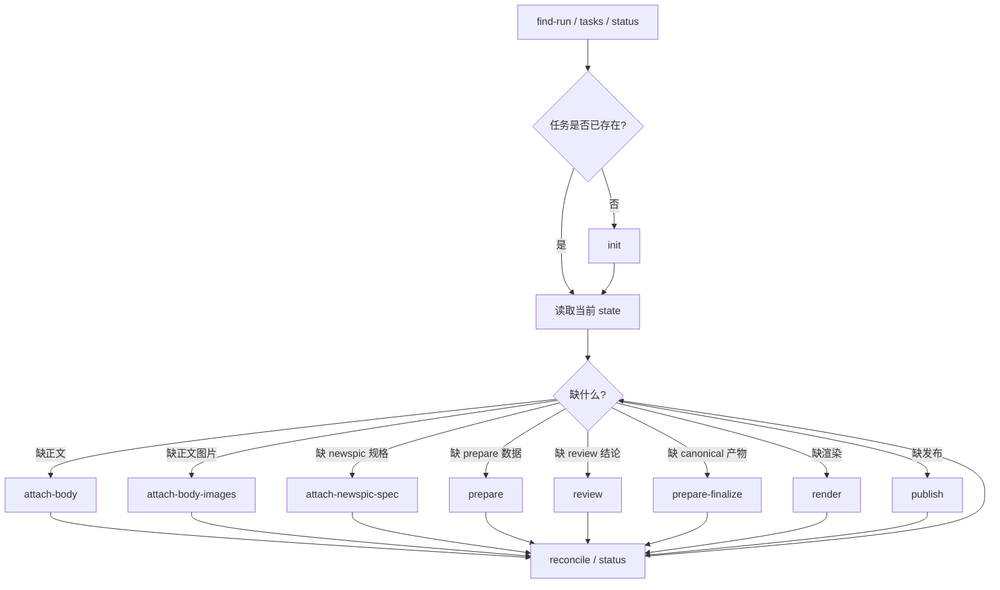

# zzhub-pipeline

面向 Agent 的内容发布状态机，将文案、图片和发布意图收敛为可恢复的工作流，推进到微信公众号文章或图片消息。

## 核心原则

- `state` 是唯一真相源
- Agent 先查任务状态，再决定下一步
- 外部工具先把素材写入 pipeline，再由 pipeline 计算缺口
- 中断后按实际状态恢复，而不是靠会话历史猜测

## 快速开始

前置条件：

- Bun 运行时
- Chrome，用于 `render` 和 `wechat-export`

安装依赖：

```bash
bun install
```

二进制别名：

- `zzhub-pipeline`
- `zzp`

配置文件位置，macOS 默认是 `~/Library/Application Support/zzhub-pipeline/config.json`。

## 架构概览

这是一个状态机模型，输入是任务意图、正文、图片、路由和发布要求，输出是可恢复的工作流状态、渲染产物和发布结果。

当前只有两条主工作流路由：

- `wechat-article`
- `wechat-newspic`

`blog` 只做事后同步，不参与主工作流分支。

状态文件分两类：

- 运行态，临时文件，`{workspace}/.zzhub-media/runs/{run_id}.json`
- 定稿态，最终文件，`{workspace}/posts/{date-slug}/workflow-state.json`

正文全文不会进入 state，正文内容统一放在 `{workspace}/.zzhub-media/tmp/{run_id}/`。

## 目录结构

```text
src/
  cli.ts                  # 入口，命令分发
  plugins.ts              # 命令注册表，workflow 和 ops 两组
  state.ts                # WorkflowState 类型 + CRUD，权威合约
  task-manager.ts         # 任务列举，查找，状态报告
  task-views.ts           # markdown / agent 视图渲染
  workflow-materials.ts   # 正文路径解析，素材对账
  routes.ts               # 确定性路由表，关键词匹配 + 账号解析
  profiles.ts             # 创作规则，改写许可，风格模式决策树
  text.ts                 # 文本格式化工具，frontmatter，markdown 规范化
  output.ts               # TTY 感知输出层，pretty / JSON
  config.ts               # 配置加载，env 覆盖，工作区路径解析
  args.ts                 # 参数解析
  spawn.ts                # 子进程封装，PATH 增强，bun 二进制定位
  commands/               # 每个 CLI 命令一个文件，共 22 个
  imgx/                   # 图片渲染子系统，Chrome headless + @napi-rs/canvas
    runtime.ts            # Chrome 截图，DOM dump，模板工具
    render-article.ts     # longform-3-4 长文渲染器
    render-card.ts        # 封面卡片渲染器
    render-ascii-portrait.ts # ASCII 人像渲染
    render-x-like-posts.ts # X / Twitter 风格帖子渲染
    poster-recipe.ts      # 海报配方系统
    geometry.ts           # 页面几何计算
    longform-theme.ts     # 长文主题定义
    pretext-adapter.ts    # pretext 分页适配器
    pretext-runtime.ts    # 进程内分页运行时
  providers/              # 发布提供者
    index.ts              # 提供者注册表
    wechat.ts             # 微信公众号，文章草稿和图片消息
    cos.ts                # 腾讯云 COS 图片 CDN
    zotepad.ts            # Zotepad HTML 导出
    blog.ts               # 博客 markdown 同步
  wechat-preview/         # 微信文章 HTML 预览，Milkdown + 主题
    index.ts
    themes.ts
    wechat-formatter.ts
    frontmatter-handler.ts
    browser/
      editor-export.ts
      editor-export.css
    assets/
      templates/
      fonts/
      browser-dist/
```

## 命令参考

`workflow` 组，16 个命令：

| 命令 | 说明 |
| --- | --- |
| `init` | Create run state from intent classification |
| `attach-body` | Attach a source body file to a managed task |
| `attach-body-images` | Attach body image marker files to a managed task |
| `attach-newspic-spec` | Attach or update newspic render intent |
| `prepare` | Route + author + format + metadata |
| `prepare-finalize` | Highlight words + asset save |
| `render` | Image plan + imgx render |
| `publish` | Execute publish routes |
| `reconcile` | Reconcile managed task materials and derived state |
| `checkpoint` | Read task state and validate current phase |
| `status` | Read a managed task with gaps and next action |
| `find-run` | Find the best matching managed task |
| `tasks` | List managed tasks in the workspace |
| `reset` | Reset phases for revision |
| `review` | Update content review status |
| `abandon` | Mark one or more tasks as abandoned |

`ops` 组，7 个命令：

| 命令 | 说明 |
| --- | --- |
| `sync-blog` | Copy canonical markdown to the blog repo and publish there |
| `imgx` | Run bundled imgx renderer subcommands |
| `wechat-export` | Render markdown to WeChat HTML with bundled preview styles |
| `cos-upload` | Upload a local image to configured COS CDN |
| `config` | Read or update pipeline config |
| `doctor` | Inspect resolved paths and provider health |
| `hermes-metrics` | Show Hermes execution metrics per task |

## 核心流程



## 常用命令

### 任务管理

```bash
bun run src/cli.ts tasks --workspace {workspace}
bun run src/cli.ts tasks --workspace {workspace} --active
bun run src/cli.ts tasks --workspace {workspace} --active --view markdown
bun run src/cli.ts find-run --workspace {workspace} --active
bun run src/cli.ts find-run --workspace {workspace} --active --view agent
bun run src/cli.ts status --workspace {workspace}
bun run src/cli.ts status --state {workspace}/posts/{date-slug}/workflow-state.json
bun run src/cli.ts status --state {workspace}/posts/{date-slug}/workflow-state.json --view agent
bun run src/cli.ts reconcile --state {workspace}/posts/{date-slug}/workflow-state.json
```

### 新建与接入素材

```bash
bun run src/cli.ts init \
  --workspace {workspace} \
  --task-kind publish \
  --content-form article \
  --targets wechat \
  --content-origin user \
  --intent-text "发公众号文章给大号" \
  --requires-render \
  --requires-publish

bun run src/cli.ts attach-body \
  --state {workspace}/.zzhub-media/runs/{run_id}.json \
  --body-text "正文内容"

bun run src/cli.ts attach-body-images \
  --state {workspace}/.zzhub-media/runs/{run_id}.json \
  --images-file {workspace}/images.json

bun run src/cli.ts attach-newspic-spec \
  --state {workspace}/.zzhub-media/runs/{run_id}.json \
  --file {workspace}/newspic-spec.json
```

`images.json` 支持两种形式：

```json
[
  { "marker": "插图1", "path": "{workspace}/1.png" },
  { "marker": "插图2", "path": "{workspace}/2.png" }
]
```

或：

```json
{
  "插图1": "{workspace}/1.png",
  "插图2": "{workspace}/2.png"
}
```

`newspic-spec.json` 常用字段：

```json
{
  "pagination_mode": "multi",
  "min_pages": 3,
  "max_pages": 0,
  "require_image_every_page": true,
  "default_image_layout": "editorial",
  "target_fill_ratio": 0.8,
  "page_specs": [
    {
      "page": 1,
      "image_markers": ["插图1", "插图2"],
      "image_layout": "staggered",
      "target_fill_ratio": 0.85
    },
    {
      "page": 2,
      "image_markers": ["插图3"]
    }
  ]
}
```

说明：

- `target_fill_ratio` 是可选字段，默认 `0.8`
- `page_specs[].target_fill_ratio` 优先级高于顶层
- imgx 会把它当作这一页文字和图片尽量占到内容区多少的近似目标
- 实际值会被规范化到 `0.35` 到 `0.95`

如果外部工具需要某段文字固定落在某一页，除了传 `page_specs`，还应该在正文里加页标记：

```text
【第一页】
第一页正文

【第二页】
第二页正文
```

也支持英文页标记：

```text
【Page 1】
...
【Page 2】
...
```

兼容性说明：

- 不加页标记，继续走自动流排，按正文 block 顺序自动分配到多页
- 加了页标记并且存在 `page_specs`，会切换到 spec 驱动分页，页标记变成硬边界
- 旧调用方可以继续工作，只有需要固定某段文字属于某一页时，才需要补正文页标记或新增 `target_fill_ratio`

`longform-3-4` 的几何约定：

- 长文分页测量优先在进程内跑 `pretext`，不再依赖 Chrome dump
- 内容区不再假定固定值，默认由页面尺寸、header、footer、padding 推导
- 调用方需要显式指定内容区或页面几何时，可以传这些参数：
  - `--page-width` / `--page-height`
  - `--body-padding-x` / `--body-padding-y`
  - `--logo-size` / `--logo-gap`
  - `--footer-height` / `--footer-margin-top`
  - `--content-width` / `--content-height`
  - `--content-bottom-gap`

如果没有显式传 `--content-width` 和 `--content-height`，imgx 会按当前页面几何自动推导内容区。

### 推进工作流

```bash
bun run src/cli.ts prepare --state {workspace}/.zzhub-media/runs/{run_id}.json --body {workspace}/body.md
bun run src/cli.ts review --state {workspace}/.zzhub-media/runs/{run_id}.json --status passed
bun run src/cli.ts prepare-finalize --state {workspace}/.zzhub-media/runs/{run_id}.json --body {workspace}/body.md
bun run src/cli.ts render --state {workspace}/posts/{date-slug}/workflow-state.json
bun run src/cli.ts publish --state {workspace}/posts/{date-slug}/workflow-state.json
```

### Blog 同步

```bash
bun run src/cli.ts sync-blog --state {workspace}/posts/{date-slug}/workflow-state.json
```

这条命令会：

- 读取 canonical `post.md`
- 复制到博客仓库 `content/posts/<slug>.md`
- 执行博客发布命令

### 配置管理

```bash
bun run src/cli.ts config
bun run src/cli.ts config --key paths.workspaceRoot
bun run src/cli.ts config --key paths.workspaceRoot --value /abs/path
```

### 诊断

```bash
bun run src/cli.ts doctor
bun run src/cli.ts hermes-metrics --workspace /abs/workspace
```

### 微信 HTML 预览导出

```bash
bun run src/cli.ts wechat-export --body /abs/path/body.md --account default
```

### COS 图片上传

```bash
bun run src/cli.ts cos-upload --file /abs/path/image.png --folder notes/note-id --alt image
```

## 状态文件

最重要的字段是：

| 字段 | 作用 |
| --- | --- |
| `run_id` | 任务唯一标识 |
| `created_at` / `updated_at` | 任务时间信息 |
| `phase.current` | 当前阶段 |
| `intent` | 上游分类结果与发布要求 |
| `route` | 当前微信路由和账号 |
| `metadata` | 标题、slug、日期、摘要 |
| `images.body_inputs` | 正文插图缺口与已接入图片 |
| `images.render_assets` | 已渲染出的封面与分页图 |
| `publish.results` | 发布结果 |

正文全文不进 state。state 只保存恢复流程需要的事实、路径、版本和结果，正文内容放在 `{workspace}/.zzhub-media/tmp/{run_id}/`。

## 配置系统

配置文件位置：

- macOS, `~/Library/Application Support/zzhub-pipeline/config.json`
- Linux, `~/.config/zzhub-pipeline/config.json`

可以用环境变量覆盖配置文件路径：

- `ZZHUB_PIPELINE_CONFIG=/abs/path/config.json`

其他环境变量覆盖：

- `ZZHUB_PIPELINE_WORKSPACE_ROOT`，workspace root path
- `ZZHUB_PIPELINE_POSTS_DIR`，posts directory name，默认 `posts`
- `ZZHUB_PIPELINE_BLOG_ROOT`，blog repository root

兼容旧配置时，会自动读取 `zzclub-z-cli` 的配置。

配置结构概览：

- `paths`
- `services`
- `commands`
- `wx`，accounts
- `cos`

## 输出系统

- 非 TTY，或者重定向和管道场景，固定输出原始 JSON
- TTY 场景输出带 ANSI 颜色的 pretty 结果
- `FORCE_COLOR=1` 可以在非 TTY 下强制 pretty 输出
- `NO_COLOR=1` 可以在 TTY 下强制原始 JSON
- `--view` 支持 `json`，`markdown`，`agent`
- `--view agent` 更适合 orchestrator 直接读取下一步

## imgx 渲染子系统

- 基于 Chrome headless 和 `@napi-rs/canvas`
- 模板包括 `longform-3-4`，用于 newspic 长文，和 `wechat-cover-split`，用于文章封面
- 主题包括 `paper-sage`，默认账号，以及 `linen-news`，`ancientone` 账号
- 几何参数会从 header，footer，padding 自动推导，也可以通过 CLI 旗标显式控制
- 分页在进程内通过 `@chenglou/pretext` 完成，不依赖 Chrome dump
- `render` 和 `wechat-export` 都需要 Chrome

## wechat-preview 子系统

- 基于 Milkdown 的 markdown 到微信 HTML 转换
- 支持多主题
- 构建命令：`bun run build:wechat-preview`
- `wechat-export` 会直接使用这套预览样式

## 发布提供者

| 提供者 | 路由 | 说明 |
| --- | --- | --- |
| wechat | `wechat-article` | 创建公众号文章草稿 |
| wechat | `wechat-newspic` | 发送图片消息 |
| zotepad | `wechat-article` | Markdown → WeChat HTML 转换 |
| cos | - | 腾讯云 COS 图片 CDN |
| blog | - | Markdown 同步到博客仓库 |

## newspic 规格

`newspic` 的渲染规格支持两种分页模式：

- `auto`，自动流排
- `single`，单页
- `multi`，多页

常用 JSON 字段：

```json
{
  "pagination_mode": "multi",
  "min_pages": 3,
  "max_pages": 0,
  "require_image_every_page": true,
  "default_image_layout": "editorial",
  "target_fill_ratio": 0.8,
  "page_specs": [
    {
      "page": 1,
      "image_markers": ["插图1", "插图2"],
      "image_layout": "staggered",
      "target_fill_ratio": 0.85
    },
    {
      "page": 2,
      "image_markers": ["插图3"]
    }
  ]
}
```

说明：

- `target_fill_ratio` 默认是 `0.8`
- `page_specs[].target_fill_ratio` 优先级高于顶层
- 这个值表示文字和图片尽量占到内容区多少，是一个近似目标
- 实际值会被规范化到 `0.35` 到 `0.95`

如果外部工具需要把某段文字固定到某一页，除了传 `page_specs`，还应该在正文里加页标记：

```text
【第一页】
第一页正文

【第二页】
第二页正文
```

也支持英文页标记：

```text
【Page 1】
...
【Page 2】
...
```

兼容性说明：

- 不加页标记时，仍然走自动流排，按正文 block 顺序分配到多页
- 加了页标记并且存在 `page_specs` 时，会切换到 spec 驱动分页，页标记变成硬边界
- 旧调用方可以继续工作，只有需要固定页面归属时才需要补页标记或调整 `target_fill_ratio`

`longform-3-4` 的几何参数包括：

- `--page-width` / `--page-height`
- `--body-padding-x` / `--body-padding-y`
- `--logo-size` / `--logo-gap`
- `--footer-height` / `--footer-margin-top`
- `--content-width` / `--content-height`
- `--content-bottom-gap`

## 测试与验证

```bash
bun test
bun x tsc --noEmit
```

## 代码阅读顺序

1. `src/cli.ts`
2. `src/plugins.ts`
3. `src/state.ts`
4. `src/task-manager.ts`
5. `src/routes.ts`
6. `src/profiles.ts`
7. `src/workflow-materials.ts`
8. `src/commands/prepare.ts`
9. `src/commands/prepare-finalize.ts`
10. `src/commands/render.ts`
11. `src/commands/publish.ts`
