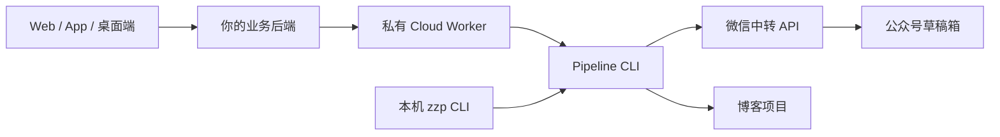

# zzhub-pipeline

一个可恢复的内容发布工作流。它把 Markdown、图片、账号和发布意图组织成一条明确的流水线，生成微信公众号草稿，或把文章同步到自己的博客项目。

Pipeline 可以独立使用，也可以作为 Web、App、桌面客户端背后的执行服务：

- **本机 CLI**：在本地准备、排版、渲染和写入草稿。
- **私有 Cloud Worker**：在服务器执行同一套 Pipeline，业务后端通过 HTTP 提交任务。
- **Agent 编排**：Agent 负责写稿、审核和修订，Pipeline 负责确定性的状态推进。

微信的 `publish` 只会创建或更新草稿，不会群发或公开发布。博客路由会执行你配置的发布命令，实际效果由该命令决定。

> Cloud Worker 已在本仓库实现，可从源码构建 Docker 镜像部署。它不包含在 npm CLI 包中；npm 只分发 CLI 和渲染资源。`v0.14.0` tag 包含初版 Worker，账号同步和正文模板等接口以实际部署的 revision 为准，生产环境请固定 commit/tag。

## 能做什么

| 能力 | 说明 |
| --- | --- |
| 公众号文章 | Markdown 转微信兼容 HTML，生成封面，上传图片，创建或更新文章草稿 |
| 公众号贴图 | 渲染单页卡片或多页 PNG 图集，创建 `newspic` 草稿 |
| 博客同步 | 把 Markdown 和图片同步到配置的博客项目，并执行发布命令 |
| 可恢复工作流 | 保存任务状态、素材、审核决定、渲染版本和发布结果，失败后可以继续或重置 |
| 多账号与多目标 | 支持多个公众号账号，以及微信、博客等发布目标 |
| 排版扩展 | 封面主题、正文模板、品牌配置和可替换渲染插件 |
| 排版工作台 | `zzp wechat-preview studio` 提供所见即所得排版调优、配色选型、语法预设与配置持久化 |
| 本机监控 | `zzp monitor` 提供任务快照、日志和 SSE 事件流 |
| 云端执行 | 私有 HTTP Worker 提供账号同步、串行队列、持久化任务和状态轮询 |

Pipeline 不内置 LLM、用户登录、计费或配额服务。调用方需要自己提供正文和审核决定；云端 Worker 接收已经确认的完整正文，并只推进支持的 CLI 动作。

## 工作方式


```mermaid
flowchart LR
    Client[Web / App / 桌面端] --> Backend[你的业务后端]
    Backend --> Worker[私有 Cloud Worker]
    Worker --> Pipeline[Pipeline CLI]
    Pipeline --> Relay[微信中转 API]
    Relay --> Draft[公众号草稿箱]
    Pipeline --> Blog[博客项目]
    CLI[本机 zzp CLI] --> Pipeline
```

客户端不需要运行 Electron，也不需要直接访问 Worker。推荐让业务后端负责用户鉴权、账号归属、任务归属、配额和幂等键隔离，再通过内部网络调用 Worker。

## 快速开始

### 安装

Pipeline 需要 [Bun](https://bun.sh/) 运行。npm 可以安装包，但命令本身仍由 Bun 执行；渲染文章还需要 Chrome 或 Chromium。

```bash
# 从 npm 安装
npm install -g @zzclub/pipeline

# 或从源码运行
git clone https://github.com/aatrooox/zzhub-pipeline.git
cd zzhub-pipeline
bun install
bun run src/cli.ts --help

# 可选：把当前源码安装成全局命令
bun install --global .
```

两个命令别名都可用：

```bash
zzp --help
zzhub-pipeline --help
```

检查本机依赖：

```bash
zzp doctor
```

图片渲染需要 `@napi-rs/canvas`，COS 上传需要 `cos-nodejs-sdk-v5`。云端 Docker 镜像会安装 Chromium 和 CJK 字体。

### 先预览一篇文章

下面的命令只生成本地产物，不访问公众号：

```bash
zzp wechat-export \
  --markdown ./article.md \
  --out ./article.html \
  --preview-shell-out ./article-preview.html \
  --no-preview
```

### 视觉排版工作台 (WeChat Visual Studio)

Pipeline 提供了开箱即用的所见即所得排版工作台：

```bash
zzp wechat-preview studio
```

终端启动后会自动唤起浏览器打开 `http://127.0.0.1:18765/studio`。你可以在界面中直观调整主题配色、二级标题与表格语法预设、提示卡片（Callout）自定义 Emoji，并一键复制到微信后台或保存为全局配置。

> **云端使用者注意**：本地 Studio 保存的样式会写入本地 `config.json`。若使用私有云端 Worker，需将调整后的配置同步至服务器，详见 [Visual Studio 排版调优与云端配置同步指南](docs/visual-studio-and-config-sync.md)。

### 推进一个发布任务

Pipeline 每次只推进一个动作。创建任务后，反复执行 `status`，按照返回的 `next_action` 继续；不要直接修改 `workflow-state.json`。

```bash
WORKSPACE="$PWD/workspace"

zzp init \
  --workspace "$WORKSPACE" \
  --task-kind publish \
  --content-form article \
  --content-origin user \
  --targets wechat \
  --intent-text "发一篇公众号文章"

# init 会返回 state_path；后续命令使用它
zzp status --state "$WORKSPACE/.zzhub-media/runs/<run_id>.json" --view agent

# 正文可以来自文件，也可以使用 --body-text
zzp attach-body \
  --state "$WORKSPACE/.zzhub-media/runs/<run_id>.json" \
  --body ./article.md

# 后续按 status 的 next_action 执行，常见顺序如下
zzp prepare --state <state_path>
zzp review --state <state_path> --status passed
zzp prepare-finalize --state <state_path>
zzp render --state <state_path>
zzp publish --state <state_path>
```

实际顺序以 `status --view agent` 为准。需要发布贴图时，把 `--content-form` 改为 `newspic`；多页图片可以在渲染前附加 `newspic` 规格。

如果正文由 Agent 生成或审核，可以直接使用仓库里的 [`zzhub-publish` Skill](skills/zzhub-publish/SKILL.md)。Skill 只负责编排 Agent，文章正文仍由调用方提供。

## 云端 Worker

Worker 是仓库里的独立 Bun 服务，入口为 `services/cloud-worker/server.ts`。它在服务器上调用 Pipeline CLI，当前支持公众号 `article` 和 `newspic` 任务，不支持博客任务，也不提供任意命令执行。

推荐链路：

```text
Web / App / 桌面端
        ↓
已鉴权的业务后端
        ↓  内部网络 + PIPELINE_WORKER_TOKEN
Cloud Worker
        ↓
Pipeline CLI → 微信中转 API → 草稿箱
```

Worker 已经可以部署，但应作为**内部服务**使用：

- 默认监听 `127.0.0.1:18887`。
- 非回环监听必须显式设置 `PIPELINE_WORKER_PRIVATE_NETWORK=1`，并由容器网络或防火墙完成隔离。
- `PIPELINE_WORKER_TOKEN` 是服务令牌，不是用户登录 token，也不是微信中转 PAT；不要下发给客户端。
- 当前是单进程串行队列，使用 JSON 文件保存任务、正文和账号；数据目录必须挂载持久卷，不支持多个副本共享同一目录。
- 任务状态为 `queued`、`running`、`succeeded`、`failed` 或 `interrupted`，`step` 表示当前 Pipeline 动作。
- 当前 Worker 只提供步骤和结果轮询，不提供云端 SSE、逐文件进度或原始日志。本机 `zzp monitor` 是另一套观测接口。

最短 Docker 启动示例：

```bash
docker build -f services/cloud-worker/Dockerfile \
  -t zzhub-pipeline-worker:local .

# 让业务后端和 Worker 只在内部网络通信
docker network create pipeline-internal

docker run -d --name pipeline-worker --restart unless-stopped \
  --network pipeline-internal \
  -e PIPELINE_WORKER_TOKEN \
  -e PIPELINE_WORKER_HOST=0.0.0.0 \
  -e PIPELINE_WORKER_PRIVATE_NETWORK=1 \
  -e PIPELINE_CONFIG_FILE=/run/secrets/pipeline.json \
  --mount type=bind,src=/absolute/path/to/pipeline.json,dst=/run/secrets/pipeline.json,readonly \
  --mount type=bind,src=/absolute/path/to/worker-data,dst=/data \
  zzhub-pipeline-worker:local
```

业务后端使用同一个服务令牌调用：

| 方法 | 路径 | 用途 |
| --- | --- | --- |
| `GET` | `/health` | 查看 Worker 是否存活、排队数和账号数 |
| `PUT` | `/v1/accounts/:account` | 写入或替换公众号凭据 |
| `DELETE` | `/v1/accounts/:account` | 删除 Worker 中的公众号凭据 |
| `POST` | `/v1/jobs` | 提交完整正文，返回 job ID |
| `GET` | `/v1/jobs/:id` | 查询步骤、状态和发布结果 |

正文必须在 Worker 环境中可读取。客户端本机路径不会自动上传；正文中的图片应使用 Worker 可访问的 URL，或使用请求允许的 Base64 数据。相同 `idempotencyKey` 且输入不变时会返回已有任务，输入变化要使用新的键。

详细的环境变量、请求字段、Docker 网络、更新和故障恢复流程见 [`services/cloud-worker/README.md`](services/cloud-worker/README.md)。

### 云端恢复

`WX_RESULT_UNKNOWN`、超时或 `interrupted` 不代表草稿一定没有创建。先检查原 Pipeline run 和公众号草稿箱；确认已有草稿后，优先使用 `existingDraftMediaId` 更新。不要为了盲目重试而更换幂等键，否则可能创建重复草稿。

## 配置微信和外部服务

Pipeline 不直接调用 `api.weixin.qq.com`。公众号发布需要一个兼容以下路径的微信中转 API：

- `/api/v1/wx/cgi-bin/token`
- `/api/v1/wx/cgi-bin/material/add_material`
- `/api/v1/wx/cgi-bin/draft/add`
- `/api/v1/wx/cgi-bin/draft/update`
- `/api/v1/wx/cgi-bin/draft/batchget`
- `/api/v1/wx/cgi-bin/draft/get`
- `/api/v1/wx/cgi-bin/draft/delete`

本仓库不包含中转服务。`wx.baseUrl` 应填写中转服务地址，账号 PAT、公众号 AppID 和 AppSecret 由使用者自行保管。COS 上传使用单独的 STS API；只做本地排版时无需配置微信或 COS。

本机默认配置文件：

- macOS：`~/Library/Application Support/zzhub-pipeline/config.json`
- Linux：`~/.config/zzhub-pipeline/config.json`
- Windows：`%APPDATA%/zzhub-pipeline/config.json`

最小配置示例：

```json
{
  "paths": {
    "workspaceRoot": "/absolute/path/to/workspace"
  },
  "wx": {
    "baseUrl": "https://wx-api.example.com",
    "defaultAccount": "main",
    "accounts": {
      "main": {
        "name": "我的公众号",
        "appId": "YOUR_WECHAT_APP_ID",
        "appSecret": "YOUR_WECHAT_APP_SECRET",
        "pat": "YOUR_RELAY_API_PAT"
      }
    }
  }
}
```

配置文件含凭据，请放在受控目录，不要提交到 Git。也可以使用 `ZZHUB_PIPELINE_CONFIG` 指定其他配置路径；`ZZHUB_WX_BASE_URL`、`WX_APPID`、`WX_APPSECRET` 和 `ZZCLUB_PAT` 可覆盖对应配置。

## 状态、监控与恢复

`workflow-state.json` 是单个任务的业务真相源，记录路由、素材、阶段、渲染版本和发布结果。正文文件保存在工作区，不直接写入状态 JSON。

本机监控是可选的只读服务：

```bash
zzp monitor start
zzp monitor status
zzp monitor stop
```

它提供 HTTP 快照和 SSE，适合桌面端或本机 GUI 观察多个 CLI 执行。它不负责调度、重试或取消，也不应暴露到公网。详见 [`docs/monitor.md`](docs/monitor.md)。

## 其他文档

- [Visual Studio 排版调优与云端配置同步指南](docs/visual-studio-and-config-sync.md)
- [文章发布入门](docs/cli-intro-for-article.md)：面向第一次接入的使用说明
- [云端 Worker API、部署与更新](services/cloud-worker/README.md)
- [封面主题和图片排版](docs/render-themes.md)
- [离线正文模板](ARTICLE-THEMES.md)
- [Agent 发布 Skill](skills/zzhub-publish/SKILL.md)
- [第三方声明](THIRD-PARTY-NOTICES.md)

## 开发与验证

```bash
bun install
bun test
bun x tsc --noEmit
bun run build:wechat-preview
bun run build
```

只修改 Worker 时可以先运行：

```bash
bun test services/cloud-worker/server.test.ts
```

`bun run build:npm` 会生成独立的 npm bundle；`services/cloud-worker/` 不在 npm 包的 `files` 清单中，Worker 需要从源码仓库构建。

## 许可

Pipeline 使用 [MIT License](LICENSE)。排版基础和第三方依赖的授权说明见 [THIRD-PARTY-NOTICES.md](THIRD-PARTY-NOTICES.md)；外部中转服务、COS 服务和第三方模板的费用、权限及许可由各自提供方负责。
