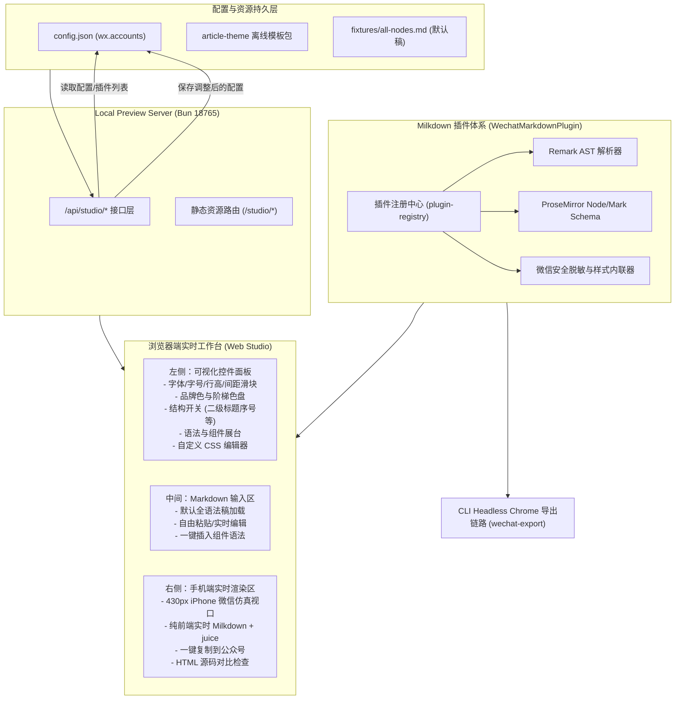

# Markdown 渲染与排版可视化工作台及 Milkdown 插件化架构方案

## 目标概述 (Goal Description)

针对当前通过 `Milkdown` 编辑器结合 Headless Chrome 导出微信 HTML 的链路中，**缺乏可视化实时调优**以及**语法扩展机制不够模块化**的问题，本方案旨在设计一套完整的解决方案：

1. **Web 可视化排版工作台 (WeChat Visual Studio)**：
   - 依托既有的 `zzp wechat-preview serve` 本地服务，提供统一的 Web 可视化入口（默认 `http://127.0.0.1:18765/studio`）。
   - 加载当前本地配置（`config.json` 账号配置、主题变量、`customCss`、`articleTheme`）。
   - 提供默认测试文章（如包含全语法节点的 `fixtures/all-nodes.md`），同时支持用户自由粘贴与实时编辑 Markdown。
   - **毫秒级纯前端实时渲染**：在浏览器端直接执行 Milkdown 解析与 `renderWechatHtml`（基于 `juice/client` 内联化），任何配置微调（字号、行高、间距、色系）或 Markdown 编辑均在 50~80ms 内即时响应。
   - **一键复制到微信公众号后台**：将格式化好的富文本 HTML 写入系统剪贴板，粘贴进微信公众号后台即可保留 100% 样式。
   - **配置双向同步**：调优满意后可一键写回本地 `config.json` 或导出为离线正文模板包 (`article-theme`)，确保 CLI `zzp wechat-export` 与云端发布具备像素级一致性。

2. **Milkdown 插件化扩展体系 (Pluggable Markdown Syntax & Components)**：
   - 设计端到端的插件契约 `WechatMarkdownPlugin`，打通 **Remark AST 解析 -> ProseMirror 节点渲染 -> 微信 HTML 安全内联转换** 全链路。
   - 允许通过插件自定义已有 Markdown 语法（如引用块、代码块）或新增自定义语法/组件（如 Callout 提示框 `> [!NOTE]`、按键 `<kbd>`、状态徽章 `[badge:success|通过]`、分步引导卡等）。
   - **已支持语法与组件可视化展台**：在 Web 页面提供专门的展示面板，清晰展示系统当前已加载的所有语法规则与组件、语法示例，并支持一键将示例代码插入到编辑器中。

---

## 总体架构与数据流 (Architecture & Data Flow)



---

## 用户需评审的关键设计点 (User Review Required)

> [!IMPORTANT]
> **1. Web Studio 访问入口与服务形态**
> - **方案推荐**：复用现有的 `zzp wechat-preview serve`（端口 `18765`），访问根路径 `/` 提供直达入口，并支持 `/studio` 专用工作台。无需启动新的服务端口，完全兼容现存命令。
> - **操作命令**：`zzp wechat-preview serve --open` 或 CLI 新增便捷别名 `zzp studio`。

> [!IMPORTANT]
> **2. 实时渲染的执行环境机制**
> - **原机制**：CLI 下的 `wechat-export` 是通过 Bun 启动 headless Chrome 进程渲染 `export-shell.html`，每次需要 1~2 秒，适合文件导出，但不适合滑块拖动等高频实时交互。
> - **工作台机制**：因为用户打开 Web Studio 时本身就已经在浏览器（Chrome/Edge/Safari）中，Milkdown 与 `renderWechatHtml`（基于 `juice/client`）都是浏览器原生兼容的代码。我们在 Web Studio 中**直接在浏览器进程内执行渲染**，渲染延迟降至 30~50ms，实现拖动滑块时真正的无延迟实时重绘！
> - **一致性保证**：浏览器端与 CLI Chrome 端使用的是完全同一套 `@zzclub/milkdown-article-style`、同一套主题变量逻辑和同一套插件体系，因此 Web 调优结果与 CLI 导出结果绝对一致。

> [!WARNING]
> **3. 插件化定义与生效边界**
> - 插件定义包含代码（Remark 语法解析规则与 ProseMirror 渲染规则），出于运行安全与稳定性考虑，**自定义插件代码在本地代码/插件仓库中编写**，而不是在 Web 页面直接 `eval` 代码。
> - Web 页面负责**读取并动态呈现**当前环境已注册的所有插件、语法说明、预览示例，并提供「一键插入到编辑器」的交互体验。

---

## 详细功能规划与实现方案 (Proposed Architecture)

---

### 1. 模块一：Milkdown 插件化扩展体系

针对用户提出的：
> “在 milkdown 里通过插件化的方式，自定义某个 md 语法的渲染方式。或者新增 md 语法，自定义组件。当然这种自定义配置可以不在 web 页面配置。但是要显示出来已经支持的语法和配置。”

#### 1.1 统一插件契约接口 (`WechatMarkdownPlugin`)

在 `src/wechat-preview/plugins/types.ts` 定义插件规范：

```typescript
import type { MilkdownPlugin } from "@milkdown/kit/ctx";
import type { WechatElementRenderer, WechatRenderContext } from "../wechat-renderer";

export interface WechatPluginDoc {
  /** 插件唯一 ID，如 "callout"、"kbd"、"highlight" */
  id: string;
  /** 展示名称，如 "提示卡片 (Callout)" */
  name: string;
  /** 插件分类 */
  category: "inline" | "block" | "container" | "component";
  /** 简明说明 */
  description: string;
  /** 语法示例，点击展台可直接插入当前光标处 */
  sampleMarkdown: string;
  /** 语法规则速查说明 */
  syntaxGuide: string;
  /** 支持的可调节 CSS 类名或 data 属性，如 [data-callout-type="warning"] */
  cssSelectors?: string[];
}

export interface WechatMarkdownPlugin {
  doc: WechatPluginDoc;
  /** 注入到 Milkdown 的插件集合（包含 Remark 解析器、ProseMirror Schema、View 等） */
  milkdownPlugins: MilkdownPlugin[];
  /** 注入到微信 HTML 生成链路的渲染器扩展（负责样式内联、微信兼容性标签替换等） */
  wechatRenderer?: WechatElementRenderer;
  /** 插件内置的基础样式（可选，优先合并） */
  defaultCss?: string;
}
```

#### 1.2 内置插件与扩展矩阵

建立 `src/wechat-preview/plugins/registry.ts`：
1. **高亮文本 (`highlight`)**：已有 `==高亮文字==` 语法（迁移为标准插件规范）。
2. **提示卡片 (`callout` / `admonition`)**：
   - 语法：GFM Alert 规范（`> [!NOTE]`、`> [!TIP]`、`> [!WARNING]`、`> [!CAUTION]` 等）。
   - 渲染效果：生成具有左侧装饰条、浅色背景、图标标签的微信安全卡片（基于 `section` + 内联边框与内边距）。
3. **按键标记 (`kbd`)**：
   - 语法：`<kbd>Cmd</kbd>` 或 `[[kbd:Enter]]`。
   - 渲染效果：立体阴影微型键帽。
4. **状态徽章 (`badge`)**：
   - 语法：`[badge:success|已上线]` 或 `[badge:info|V1.2]`。
   - 渲染效果：行内圆角微胶囊标签。
5. **用户自定义插件接入**：
   - 允许通过 `config.json` 的 `plugins.markdownPlugins: ["./plugins/my-custom-plugin.ts"]` 注册自定义插件，自动挂载到渲染引擎与工作台展台。

---

### 2. 模块二：Web 可视化调优工作台 (Web Studio UI)

在 `src/wechat-preview/browser/studio/` 构建现代化单页工作台：

```text
┌────────────────────────────────────────────────────────────────────────────────────────────────────────┐
│  zzhub-pipeline WeChat Studio  [当前账号: default ▼]  [重置] [保存至配置] [导出模板] [一键复制到公众号] │
├─────────────────────────┬──────────────────────────────────────────┬───────────────────────────────────┤
│ 🎨 样式与配置调优        │ 📝 Markdown 草稿编辑                     │ 📱 微信手机端实时预览 (430px)       │
│                         │                                          │                                   │
│ [排版] [色彩] [结构] [组件]│ [加载默认文章 (all-nodes)] [清空] [导入]     │ ┌───────────────────────────────┐ │
│ ─────────────────────── │                                          │ │ 微信排版语义节点验收           │ │
│ 【字号与排版】           │ # 微信排版语义节点验收                   │ │                               │ │
│ 正文字号: [ 16px ] ──○─ │                                          │ │ 好的排版不是抢夺注意力，      │ │
│ 行高倍数: [ 1.84 ] ──○─ │ 这是一段用于检查正文密度的中文。包含...  │ │ 而是让内容更轻松地被读完。    │ │
│ 字间距:   [ 0.01em ] ─○─ │                                          │ │                               │ │
│ 段间距:   [ 1.2em ] ──○─ │ > [!NOTE]                                │ │ ┌─ 💡 提示 ──────────────────┐ │ │
│ 两端对齐: [  开  ]      │ > 这里是卡片示例                         │ │ │ 这里是卡片示例             │ │ │
│                         │                                          │ │ └────────────────────────────┘ │ │
│ 【色彩系统】             │ ==高亮重点== 与 `代码块`                 │ │                               │ │
│ 品牌主色: [■ #ca6093]   │                                          │ │ 二级标题：清晰但不过度装饰     │ │
│ 标题颜色: [■ #292526]   │ ```ts                                    │ │                               │ │
│ 正文字色: [■ #292526]   │ const a = 1;                             │ │ [代码区域保留等宽与高亮...]   │ │
│ 引用边框: [■ #e8c9d7]   │ ```                                      │ └───────────────────────────────┘ │
│                         │                                          │                                   │
│ 【高级自定义 CSS】      │ ──────────────────────────────────────── │ 底部状态栏:                       │
│ .editor h2 { ... }      │ 字数: 1,420 | 阅读: 3 分钟 | 实时防抖 50ms│ [原始语义 HTML] [内联微信 HTML]   │
└─────────────────────────┴──────────────────────────────────────────┴───────────────────────────────────┘
```

#### 2.1 调优项映射与响应细节

所有可视化调节项精准对应到微信导出引擎支持的规范属性，拒绝无效配置：

| 分类 | 控件类型 | 目标字段 / CSS 变量 | 调优范围 / 选项 |
|---|---|---|---|
| **字号与文本** | 滑块 + 数值输入 | `containerStyle.fontSize` | 14px ~ 18px (默认 16px) |
| **行高** | 滑块 | `bodyLineHeight` | 1.5 ~ 2.2 (默认 1.84) |
| **字间距** | 滑块 | `bodyLetterSpacing` | 0 ~ 0.05em (默认 0.012em) |
| **段落间距** | 滑块 | `customCss` 中 `p { margin }` | 0.8em ~ 1.8em |
| **品牌色 (Brand)** | 色盘选择器 | `--brand`、`primaryColor` | Hex 颜色 / 透明度 |
| **正文字色** | 色盘选择器 | `bodyColor`、`--text` | Hex 颜色 |
| **二级标题色** | 色盘选择器 | `h2Color` | Hex 颜色 |
| **三级标题色** | 色盘选择器 | `h3Color` | Hex 颜色 |
| **次要/弱化文本** | 色盘选择器 | `mutedColor`、`--text-soft` | Hex 颜色 |
| **引用装饰色** | 色盘选择器 | `blockquoteBorderColor` | Hex 颜色 |
| **分割线颜色** | 色盘选择器 | `dividerColor`、`--divider` | Hex 颜色 |
| **结构：标题编号** | Switch 开关 | `structure.numberedHeadings` | 开 / 关 (自动补齐 01, 02 序号) |
| **结构：章节前缀** | 文本框 | `structure.headingLabel` | 如 `CHAPTER`, `SECTION` |
| **结构：引言前缀** | 文本框 | `structure.quoteLabel` | 如 `摘录`, `NOTE` |
| **结构：页首大图** | 图片上传/URL | `structure.headerImageUrl` | 本地图片 / URL |
| **署名落款 (Footer)**| 文本框 + 开关 | `footerText`, `footerStyle` | 支持留空或自定义作者介绍 |
| **自定义 CSS** | 代码高亮编辑器 | `customCss` | 任意有效 CSS 规则（实时安全过滤） |

#### 2.2 支持的语法与组件展台 (Syntax Cheatsheet Drawer)

在左侧面板开辟独立标签页「🧩 语法展台」：
- 动态拉取当前系统激活的所有 `WechatMarkdownPlugin`。
- 以卡片列表形式展示：
  - **标签与名称**：如 `[块级] 提示卡片 (Callout)`
  - **语法范例**：`> [!NOTE]\n> 这里是提示正文`
  - **一键插入**：点击卡片上的「插入示例」，编辑器光标位置立刻插入该语法，右侧预览立刻同步渲染出来。
  - **样式钩子**：标出该组件可在自定义 CSS 中修改的选择器（如 `section[data-wechat-node="callout"]`）。

---

### 3. 模块三：服务端 API 与数据持久化闭环

在 `src/wechat-preview/server/http.ts` 中新增 Studio 专属路由：

1. **`GET /api/studio/config`**：
   - 返回当前配置中的所有账号列表、当前账号的 `theme`（`editorVars` 与 `exportTheme`）、`customCss` 路径与内容。
   - 返回默认测试文章内容（读取 `src/wechat-preview/fixtures/all-nodes.md`）。
   - 返回已注册的插件列表及元数据文档。
2. **`POST /api/studio/save-config`**：
   - 接收用户调整后的 `account`、`editorVars`、`exportTheme`、`customCss`、`structure`。
   - 安全写回 `config.json` 对应的 `wx.accounts[account].theme`，若编辑了 `customCss` 则写入指定文件。
3. **`POST /api/studio/export-theme`**：
   - 将当前调整好的配置一键打包为符合 `ARTICLE-THEMES.md` 规范的离线模板目录（包含 `manifest.json`、`article.css`、`example.md`）。
4. **`GET /studio` 或 `/studio/index.html`**：
   - 托管由 Vite 构建出的 Studio 前端应用。

---

## 变更文件结构规划 (Proposed Changes)

### [Component 1: 插件化架构]
- `[NEW] src/wechat-preview/plugins/types.ts`: 插件接口定义（AST 插件、微信渲染器、展台元数据）。
- `[NEW] src/wechat-preview/plugins/registry.ts`: 插件注册中心，提供内置插件及配置扩展发现。
- `[NEW] src/wechat-preview/plugins/builtin-highlight.ts`: 迁移现有的 `==高亮==` 插件。
- `[NEW] src/wechat-preview/plugins/builtin-callout.ts`: 新增 GFM 提示卡片插件 (`> [!NOTE]` 等)。
- `[MODIFY] src/wechat-preview/wechat-renderer.ts`:
  - 允许注册自定义 `WechatElementRenderer`，确保新语法生成的标签（如带装饰的卡片、行内胶囊）通过白名单并正确内联样式。

### [Component 2: Web Studio 客户端开发]
- `[NEW] src/wechat-preview/browser/studio/index.html`: Studio 页面结构。
- `[NEW] src/wechat-preview/browser/studio/studio.ts`: Studio 核心逻辑（Milkdown 挂载、状态管理、防抖渲染、剪贴板复制、API 通信）。
- `[NEW] src/wechat-preview/browser/studio/studio.css`: Studio 现代化响应式界面样式。
- `[NEW] src/wechat-preview/browser/studio/components/controls.ts`: 字号、行高、色盘、开关等控件控制器。
- `[NEW] src/wechat-preview/browser/studio/components/syntax-cheatsheet.ts`: 语法与组件展台渲染与一键插入逻辑。
- `[MODIFY] vite.wechat-preview.config.ts`:
  - 配置多页面入口，同时打包 `editor-export.ts`（供 CLI Chrome 用）与 `studio/studio.ts`（供 Web 页面用）。

### [Component 3: Preview Server 接口扩展]
- `[MODIFY] src/wechat-preview/server/http.ts`:
  - 新增 `/studio` 页面服务。
  - 新增 `/api/studio/config` 与 `/api/studio/save-config` 等 REST 接口。
- `[MODIFY] src/commands/wechat-preview.ts`:
  - 支持 `zzp wechat-preview studio` 或打印提示已集成在同一服务器中。

---

## 验证计划 (Verification Plan)

### 自动化测试 (Automated Tests)
1. **插件机制单测**：
   `bun test src/wechat-preview/plugins/index.test.ts`
   - 验证内置插件（高亮、Callout）的 Remark 解析与 Milkdown 映射。
   - 验证插件元数据（`doc`、`sampleMarkdown`）完整性。
2. **渲染器脱敏与内联测试**：
   `bun test src/wechat-preview/wechat-renderer.test.ts`
   - 验证扩展节点通过 `ALLOWED_TAGS` 与 `ALLOWED_STYLE_PROPERTIES` 校验，无非法标签残留。
3. **Studio API 单测**：
   `bun test src/wechat-preview/server/http.test.ts`
   - 验证 `/api/studio/config` 读取与 `/api/studio/save-config` 写入的正确性与边界处理。
4. **全套集成与类型校验**：
   `bun test`
   - `bun x tsc --noEmit` 保证 strict mode 无类型报错。

### 手工实机验证 (Manual Verification)
1. **启动服务**：
   执行 `bun run src/cli.ts wechat-preview serve --open`，验证浏览器是否正常打开。
2. **实时调节交互**：
   - 打开 `/studio` 页面。
   - 确认默认加载了 `all-nodes.md` 完整用例。
   - 拖动行高滑块（1.6 -> 2.0），验证右侧手机视图文字间距立即拉开。
   - 更换品牌色盘为 `#285349`，验证二级标题与引用条颜色实时变更。
   - 切换「二级标题序号」开关，验证标题是否即时出现 `01 / 02`。
3. **语法与组件展台验证**：
   - 点击「语法展台」中的「提示卡片 (Callout)」，验证示例 Markdown 自动插入到编辑器当前光标。
   - 右侧预览视口实时显示出带样式的提示框。
4. **一键复制与微信公众号后台实测**：
   - 点击「一键复制到公众号」，打开微信公众号草稿编辑后台进行粘贴（`Cmd + V`）。
   - 验证排版、字体大小、行高、色值在微信编辑器内完全吻合。
5. **配置写回验证**：
   - 在 Studio 点击「保存至配置」。
   - 退出 Web，使用命令行执行 `zzp wechat-export --markdown fixtures/all-nodes.md --out dist/test.html`。
   - 检查 `dist/test.html` 是否准确继承了 Web 页面中调节的全新行高与色值。
